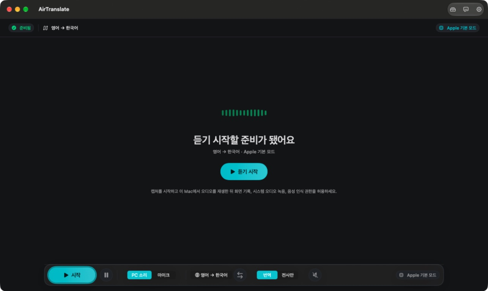
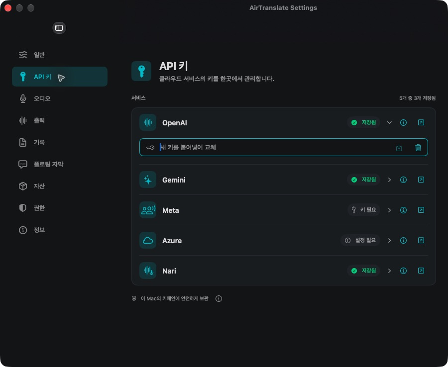

<p align="center">
  
</p>

# AirTranslate

会議、動画、講義、インタビュー、配信向けのMac音声ライブ字幕と翻訳アプリ。

<p align="center">
  <a href="https://github.com/himomohi/AirTranslate/releases/latest/download/AirTranslate.dmg"></a>
  <a href="https://github.com/himomohi/AirTranslate/releases/latest"></a>
  <a href="LICENSE"></a>
</p>

<p align="center">
  <a href="README.md">English</a> ·
  <a href="README.ko.md">한국어</a> ·
  日本語 ·
  <a href="README.zh-CN.md">中文</a> ·
  <a href="CHANGELOG.md">変更履歴</a> ·
  <a href="docs/GETTING-STARTED.md">はじめに</a>
</p>

AirTranslateはMacで再生中の音声を取り込み、ライブで文字起こしし、翻訳ワークフローを選んだ場合は翻訳し、必要に応じて他のアプリの上にフローティング字幕を表示します。Apple Modeは引き続きローカル優先の標準ワークフローです。クラウドエンジンは任意で、対応するプロバイダーキーを設定すると利用できます。

AirTranslate **1.9.2/build192** は、**設定 > アセット**からAppleのアプリ内ダウンロード承認画面を使って翻訳言語パックをダウンロードするよう修正しました。

ダウンロード後はアセットの状態を更新します。キャンセルや失敗後は再試行でき、言語を変更した場合は以前のリクエストが誤ったセッションを開始しないようにします。

フローティング字幕は双方向リサイズ、hover時の移動・リサイズ表示、カスタム文字サイズ、テキスト色、背景色と背景の不透明度、設定保存とリセットに対応しています。

文字色と背景色は **#RRGGBB カラーコード** を直接入力し、キーボードで適用することもできます。

## ダウンロード

現在の公開最新版: **v1.9.2**。

- [AirTranslate.dmgをダウンロード](https://github.com/himomohi/AirTranslate/releases/latest/download/AirTranslate.dmg)
- [AirTranslate-1.9.2.zipをダウンロード](https://github.com/himomohi/AirTranslate/releases/download/v1.9.2/AirTranslate-1.9.2.zip)
- [AirTranslate.dmg.sha256をダウンロード](https://github.com/himomohi/AirTranslate/releases/latest/download/AirTranslate.dmg.sha256)
- [バージョン履歴を見る](Release/VERSION-HISTORY.md)

オープンソースのDMGとZIPはad-hoc署名で、Appleの公証を受けていません。初回起動がブロックされた場合は[インストールガイド](docs/GETTING-STARTED.md)を確認してください。DMGのハッシュは次のように確認できます。

```bash
shasum -a 256 AirTranslate.dmg
cat AirTranslate.dmg.sha256
```

## 実際のアプリ



キャプチャ開始前のAirTranslateワークスペースです（韓国語UI）。

AirTranslateは原文の文字起こしと翻訳文を1つのワークスペースに保ち、別のアプリで視聴または作業している間はフローティング字幕で表示できます。

<details>
<summary>APIキー画面</summary>



</details>

## 3ステップで開始

1. アプリをインストールし、実際に使うコピーを起動して、macOSが求める画面収録とシステムオーディオ録音の権限を許可します。
2. 原文言語と翻訳言語を選び、コンソールからApple Modeまたは任意のエンジンを選択します。
3. **Start**を押し、Macの音声を再生するかマイク入力を選び、メインワークスペースまたはフローティング字幕で読みます。

API連携エンジンは、**Settings > API Keys**でキーを設定すると利用できます。キー設定済みとはAirTranslateにローカルのプロバイダー設定があるという意味で、プロバイダーのアクセス権はセッション開始時に確認されます。

## 主な機能

- ScreenCaptureKitによるシステムオーディオ取り込みと、内蔵、Bluetooth、AirPodsマイク入力。
- ローカル優先の標準経路であるApple Speech文字起こしとApple Translation翻訳。
- 翻訳なしで原文字幕だけを見る文字起こし専用モード。
- フローティング字幕、保存済み記録ライブラリ、任意の翻訳音声、ワンクリック言語入れ替え。
- フローティング字幕ウィンドウの双方向リサイズ、移動・リサイズ表示、カスタム文字サイズ、テキスト色、背景色、文字を薄くしない背景の不透明度、設定保存とリセット。
- 記録ファイル保存はデフォルトでオフです。Application Supportに通常の`.txt`ファイルを残す場合は**Save Transcript Files**を有効にします。
- 英語、韓国語、日本語、簡体字中国語のアプリ言語。

## エンジン

| エンジン | 役割 | 必要なもの |
| --- | --- | --- |
| Apple Mode | 標準のローカル優先文字起こしと翻訳です。 | なし |
| GPT Mode | OpenAI Realtimeによるライブ翻訳出力です。 | OpenAI |
| GPT Transcription | OpenAIによる原文字幕です。 | OpenAI |
| Gemini Live | Geminiライブ翻訳、または音声言語を自動検出する原文文字起こしです。 | Gemini |
| Meta Scribe | AirTranslate翻訳の前段にある、話者ラベル付き多言語文字起こしです。 | Meta |
| Azure MAI | Apple Translation字幕と組み合わせるプレビューのクラウド文字起こしです。 | Azure Speechキーとエンドポイント |
| Nari STT | 1.9.0ソースで準備されたNari Qwen3-ASR原文文字起こしです。マイクまたはMac音声を使えます。 | Nari |

Nari STTは1.9.0の任意エンジンです。Nariの初回選択は原文文字起こしとして開始し、原文言語が利用できる場合はApple Translationで翻訳できます。Nariの現在のGA STTモデルIDはqwen3-asr-fastとqwen3-asrで、利用可否、利用制限、有料クレジット条件はNariのプロバイダー文書とアカウント状態に従います。詳細は[docs/nari-stt.md](docs/nari-stt.md)にまとめています。

Nariは韓国語を含む入力言語の手動選択と音声言語の自動検出に対応します。

Nariを新しく選択すると、Nariクレジットが必要なGA Fastモデルを使用します。保存済みのFree Public Betaモデルの選択は保持して開始をブロックし、有料モデルへ自動移行しません。設定 > 一般で課金の案内を確認し、GAモデルを明示的に選択するとNari STTを再開できます。

## フローティング字幕

フローティング字幕ウィンドウは横方向と縦方向の両方でリサイズでき、hover状態で移動とリサイズの表示を出します。字幕スタイルには既存のプリセット文字サイズに加えてカスタムサイズ、テキスト色、背景色、文字を薄くしない背景の不透明度、設定保存とリセットがあります。Caption Stabilityは別の設定として維持されます。

## APIキー

1.9.0のAPIキー画面は、**OpenAI**、**Gemini**、**Meta**、**Azure**、**Nari**を1つのプロバイダー一覧で管理します。各行には、設定/準備状態、プロバイダーアイコン、キー管理コンソールへのリンク、設定済みキーがプロバイダー権限の検証を意味しないことを説明する情報ポップオーバーが表示されます。

キーはmacOS Keychainに保存されます。AirTranslateにはアカウントシステム、開発者運用の中継サーバー、ハードコードされたプロバイダーキーは含まれていません。

## プライバシー

- Apple ModeはmacOSフレームワークとApple管理の言語アセットを使います。
- GPT、Gemini、Meta、Azure、Nariモードは、選択した機能に必要な音声またはテキストだけを、ユーザーのキーで該当プロバイダーへ直接送信します。
- 保存済み記録は、ファイル保存を有効にした場合にだけMac上の通常のテキストファイルとして残ります。
- より詳しいプロバイダーと保存の説明は[Release/PRIVACY-NOTICE.md](Release/PRIVACY-NOTICE.md)を参照してください。

## 必要条件

- macOS 26.0以降
- ソースビルド用Swift 6.2以降
- システムオーディオ取り込みに対応したMac
- Apple SpeechとApple Translationフレームワークが利用できる環境
- 任意: OpenAI、Gemini、Meta、Azure Speech、Nariのプロバイダーキー

## ドキュメント

- [Getting Started](docs/GETTING-STARTED.md)
- [Development](docs/DEVELOPMENT.md)
- [Nari STT notes](docs/nari-stt.md)
- [変更履歴](CHANGELOG.md)
- [バージョン履歴](Release/VERSION-HISTORY.md)

<details>
<summary>ソースからビルド</summary>

```bash
./script/build_and_run.sh
./script/build_and_run.sh --verify
swift test
```

その他のコマンドは[docs/DEVELOPMENT.md](docs/DEVELOPMENT.md)にあります。

</details>

## コントリビュート

ユーザー向けのリリース履歴は[CHANGELOG.md](CHANGELOG.md)に保管します。READMEは過去のリリースノートを繰り返すのではなく、現在の製品、ダウンロード経路、プロバイダー境界を説明します。

## ライセンス

AirTranslateは[Apache License 2.0](LICENSE)で公開されています。著作権表記は[NOTICE](NOTICE)にあります。

AirTranslateは独立したオープンソースプロジェクトであり、Apple、OpenAI、Google、Meta、Microsoft、Nariとは提携していません。
