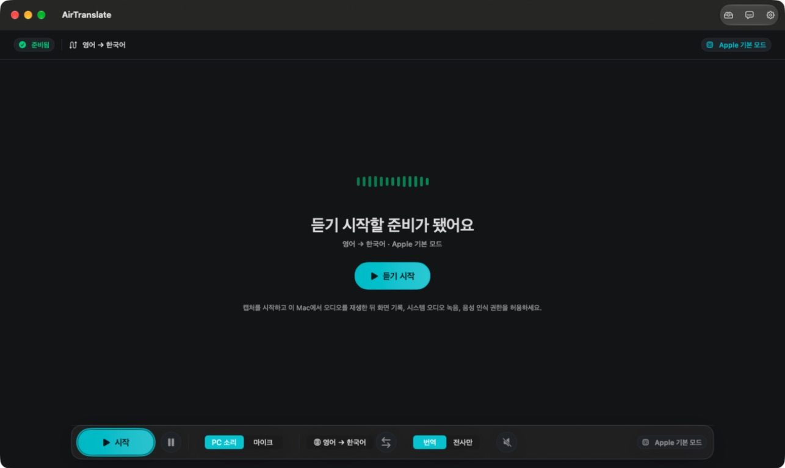

<p align="center">
  
</p>

# AirTranslate

Live Mac audio captions and translation for meetings, videos, lectures, interviews, and streams.

<p align="center">
  <a href="https://github.com/himomohi/AirTranslate/releases/latest/download/AirTranslate.dmg"></a>
  <a href="https://github.com/himomohi/AirTranslate/releases/latest"></a>
  <a href="LICENSE"></a>
</p>

<p align="center">
  English ·
  <a href="README.ko.md">한국어</a> ·
  <a href="README.ja.md">日本語</a> ·
  <a href="README.zh-CN.md">中文</a> ·
  <a href="CHANGELOG.md">Changelog</a> ·
  <a href="docs/GETTING-STARTED.md">Getting Started</a>
</p>

AirTranslate captures audio playing on your Mac, transcribes it live, translates it when you choose a translation workflow, and can keep captions floating above other apps. Apple Mode remains the default local-first workflow. Cloud engines are optional and become available after you configure the matching provider key.

AirTranslate **1.16.0/build1160** improves transcription stability, duplicate translation handling, caption reading, and window controls, and adds Apple translation options, experimental Jev candidate selection, and floating-only capture.

- **Floating-only start and controls:** starts an idle session or resumes a paused one, then minimizes the main window after capture is running. If startup fails, the main controls remain available. Start/stop and pause/resume are also available from the menu bar and app menus.
- **Previous-caption history:** keeps one previous caption block visible briefly alongside the current text, with up to two lines and an eight-second lifetime. It respects Reduce Motion.
- **Floating-caption rendering:** keeps current text in position without repeated replacement fades, reuses bounded layouts, and avoids repeatedly formatting the entire transcript. The minimized main window skips caption display work while recognition and translation continue.
- **Apple transcription and translation flow:** retains surrounding recognition context and preserves Apple-finalized segments when recognition advances, even without a separate final-text event. Previous segments are not lost or duplicated during that transition.
- **Reduced duplicate translation:** matching interim and final transcripts share the in-flight translation, and identical results are not applied twice.
- **Final captions and restarted sessions:** revised final text supersedes stale interim work. Late results or errors from stopped sessions cannot overwrite a new session, and repeated phrases in separate utterances keep their order.
- **Short transcript handling:** changing short fragments wait for a quiet interval after the last text change; complete phrases can proceed sooner. Punctuation-only results do not trigger translation.
- **Reading history and keeping your place:** scrolling through older captions pauses automatic following. Return to the latest captions to resume it; minimizing or hiding the main window preserves the reading position.
- **Less work for closed captions:** closing floating captions stops their display timers and layout work while transcription and translation continue.
- **Reopening floating captions:** restores the latest available text without retranslating it, prevents duplicated interim text, and clears a corrected source text's outdated translation after its hold period.
- **Main-window restoration:** exiting floating-only mode restores only the windows minimized by that mode, including when captions close during minimization. Windows you had already minimized are kept separate.
- **Consistent capture and menu controls:** main-window, menu-bar, and keyboard actions share preparation, finishing, and reconnecting states and available actions. Menus also share caption display mode and font-size controls.
- **Experimental Jev candidate selection:** off by default. In Apple transcription with translation, Jev can choose among supplied final recognition candidates before translation. Enabling it sends candidate text and up to six recent transcript segments (1,000 UTF-8 bytes) directly to TypeSafe using your Keychain-stored key. It adds API usage and up to 1.2 seconds of response waiting per request. Missing candidates, uncertainty, errors, or timeout keep the original. Accuracy improvement is not guaranteed. [Setup and data handling](docs/apple-translation-options.md).
- **Apple translation quality and protected terms:** on macOS 26.4+, choose Realtime (default) or Quality first and register terms to retain their spelling. Quality first may take longer and depends on Apple's available models. If it fails, the language pair uses realtime translation until app restart. If a registered term changes, the affected segment stays in its original language. These options apply to Apple text translation.
- **macOS 27 audio input compatibility:** adapts differing PCM input formats for Apple speech recognition, while retaining the existing 16 kHz mono path.
- **Source build requirements:** Xcode 27 with the macOS 27 SDK and Swift 6.4 or later. The distributed app still requires macOS 26 or later.

Configure an **Alibaba Cloud Singapore API key** in Settings > API Keys > Qwen. Qwen3.8 LiveTranslate also requires a workspace ID; Qwen Audio 3.1 Realtime Plus and Filetrans use the key without one. The key is stored separately in macOS Keychain; selected realtime audio is sent directly to Alibaba Cloud Singapore when capture starts. Choose the existing `qwen3.8-livetranslate-flash-realtime` default or `qwen-audio-3.1-realtime-plus` in Settings > General. Qwen Audio 3.1 Realtime Plus is a full-duplex voice-conversation model that receives translation instructions from AirTranslate; Qwen3.8 LiveTranslate is the dedicated realtime translation model. **Speech output is optional and initially off**. Current Qwen Audio pricing is shown in Model Studio.

Settings > General also includes `qwen-audio-3.1-asr-flash-filetrans` for asynchronous transcription. **Only a public HTTPS audio URL is accepted**; QwenCloud fetches its audio, and AirTranslate does not upload a local file in this workflow. Share only audio you are authorized to send. See [Qwen setup and pricing](docs/qwen-livetranslate.md). Real-account authentication, billing, translation and transcription quality, and latency remain unverified.

The **key-aware mode picker** shows unavailable providers in gray and provides a settings shortcut on each row. Information icons describe the selected model and its pricing basis. **OpenAI Audio unifies translation and source transcription** while preserving the selected language and output preferences. The main picker exposes Apple, OpenAI, Gemini, Qwen, and Nari choices with task-specific model descriptions; translated-speech models use a separate selector.

**Floating captions show text only**: no window background, border, toolbar, status text, or hover resize controls. Five text styles, font and color options, width, line spacing, ordering, and sample previews are available in Settings. Use the main window, menu bar, or ⌘⇧C to show or hide captions.

**Qwen final captions are drained before stopping**. Empty final results retract provisional captions, and saved Qwen transcripts contain confirmed results only, including periodic checkpoints. Apple Mode remains the default; transcript file saving remains opt-in.

**Translated speech output is selectable** in Settings and the main workspace's separate translated-speech control. Choose Apple system speech, Gemini 3.8 Flash or Flash-Lite TTS, or MAI Voice 2.1 or Flash. The choice is saved during realtime modes but used only for text translation; realtime providers keep their native audio. Gemini TTS sends only stable translated text to Google with your Gemini key.

## Download

Latest public release: **v1.16.0**.

- [Download AirTranslate.dmg](https://github.com/himomohi/AirTranslate/releases/latest/download/AirTranslate.dmg)
- [Download AirTranslate-1.16.0.zip](https://github.com/himomohi/AirTranslate/releases/download/v1.16.0/AirTranslate-1.16.0.zip)
- [Download AirTranslate.dmg.sha256](https://github.com/himomohi/AirTranslate/releases/latest/download/AirTranslate.dmg.sha256)
- [View release history](Release/VERSION-HISTORY.md)

The open-source DMG and ZIP are ad-hoc signed and not Apple-notarized. If macOS blocks the first launch, follow the [installation guide](docs/GETTING-STARTED.md). Check the DMG hash with:

```bash
shasum -a 256 AirTranslate.dmg
cat AirTranslate.dmg.sha256
```


## Real App



AirTranslate workspace before starting capture.

AirTranslate keeps the source transcript and translated text in one workspace, with a floating caption option for watching or listening in another app.

## Start In 3 Steps

1. Install the app, launch the exact copy you want to use, and allow Screen Recording and System Audio Recording when macOS asks.
2. Choose the source and target languages, then select Apple Mode or an optional engine from the console.
3. Press **Start**, play Mac audio or choose a microphone input, and read captions in the main workspace or floating caption window.

API-backed engines become available after you configure their keys in **Settings > API Keys**. A configured key means AirTranslate has local provider settings; provider access is checked when a session starts.

## Core Features

- System-audio capture through ScreenCaptureKit, plus built-in, Bluetooth, and AirPods microphone input.
- Apple Speech transcription and Apple Translation output as the default local-first path.
- Original-only transcription for source captions without translation.
- Floating captions, saved transcript library, optional translated speech, and one-click language swap.
- Text-only floating captions with five styles, font and color options, width, line spacing, ordering, previews, persistence, and reset in Settings.
- Transcript file saving is off by default; enable **Save Transcript Files** when you want plain `.txt` files in Application Support.
- Four app languages: English, Korean, Japanese, and Simplified Chinese.

## Engines

| Engine | Role | Requires |
| --- | --- | --- |
| Apple Mode | Default local-first transcription and translation. Apple basic-mode source-language auto-detect remains disabled while language-switch handling is improved. | None |
| OpenAI Audio | Choose translation or source transcription within one provider. The output icons select `gpt-realtime-translate` or `gpt-live-transcribe`; tooltips show the active model and rate. | OpenAI |
| Gemini Live | Select the documented realtime translation model or the separate source-only transcription model with automatic spoken-language detection. | Gemini |
| Meta Scribe | Speaker-labeled multilingual transcription before AirTranslate translation. | Meta |
| Azure MAI | MAI-Transcribe-2 via five-second REST chunks, or MAI-Transcribe-2-Streaming with partial captions and Apple translation. | Resource key and endpoint; Foundry deployment name for streaming |
| Nari STT | Nari Qwen3-ASR source transcription from microphone or Mac audio. | Nari |
| Grok STT | Grok Voice Transcribe 2.0 source transcription from microphone or Mac audio. | SpaceXAI (xAI) |
| Qwen LiveTranslate | Qwen3.8 is the dedicated realtime translation model. Qwen Audio 3.1 Realtime Plus is a full-duplex voice-conversation model used with AirTranslate translation instructions and can return speech. | Alibaba Cloud Singapore API key; workspace ID for Qwen3.8 |

Qwen Audio 3.1 ASR Flash Filetrans is available in Settings > General for asynchronous transcription from a public HTTPS audio URL. QwenCloud fetches the URL; local audio-file uploads are not supported by this workflow.

Grok STT is included from version 1.10.0. It starts with original-only captions and uses your own xAI API key. See [Grok STT notes](docs/grok-stt.md) for setup, language behavior, and verification limits.

Nari STT is an optional 1.9.0 engine. The first Nari selection starts as original-only transcription; translation uses Apple Translation when the source language is available. Nari's current GA STT model IDs are qwen3-asr-fast and qwen3-asr; availability, rate limits, and paid credits follow Nari's provider documentation and account state, summarized in [docs/nari-stt.md](docs/nari-stt.md).

Nari supports manual source-language selection and automatic spoken-language detection, including Korean.

New Nari selections use the GA Fast model and require Nari credits. Saved Free Public Beta model choices are preserved and blocked from starting; they are never automatically upgraded to a paid model. Review the billing notice in Settings > General and explicitly select a GA model to resume Nari STT.

## Floating Captions

Floating captions show only the original and/or translated text over your content. There is no window background, border, toolbar, status label, or resize grip, including on hover. When there is no caption text, the overlay stays invisible. Caption controls remain in Settings, the main window, and the menu bar; ⌘⇧C shows or hides captions.

Choose from five text styles (Everyday, Cinema, Lecture, High contrast, and Light scene), four font families, weight, line spacing, shadow or outline, text color, alignment, line count, and translation-first ordering. The preview uses the actual 18–72 pt text size over a light or dark sample scene. Preview sample captions without recording, and adjust their width and always-on-top behavior in Settings. Existing appearance preferences still load; legacy background settings do not create a visible window.

## Microsoft MAI audio (1.15.0)

Choose **MAI-Transcribe-2-Streaming** under Azure MAI for partial source captions. Configure the Microsoft Foundry resource endpoint (`https://<resource>.services.ai.azure.com`), its key and your deployment name in API Keys. AirTranslate commits audio every three seconds and at pause/stop, then translates finalized text with Apple. The existing five-second MAI-Transcribe-2 option remains available.

Choose **MAI-Voice-2.1** or **MAI-Voice-2.1-Flash** in translated speech output and save an **OpenRouter** key. Voice selection follows the target language and the published voice catalog. Korean is supported; Japanese currently is not. Only translated text is sent for voice generation. Provider usage is billed separately. [Configuration details](docs/microsoft-mai-audio.md).

Stopping Azure capture waits for the last finalized translations within a bounded timeout. Empty final Azure results clear provisional text from both the main workspace and floating captions.

## API Keys

The API Keys screen manages **OpenAI**, **Gemini**, **Meta**, **Azure**, **Nari**, and **SpaceXAI (xAI)** · **Alibaba Cloud (Qwen)** · **OpenRouter** · **TypeSafe (Jev)** in one provider list. Rows show configured/setup state, provider icons, key console links, and an information popover explaining that configured keys do not prove provider authorization.

Keys are stored in macOS Keychain. AirTranslate does not ship with an account system, a developer-operated relay server, or hardcoded provider keys.

The Gemini key is shared by Gemini Live and optional Gemini translated speech output. Selecting Gemini TTS does not verify account authorization, billing, quality, or latency until used with a real account.

## Privacy

- Apple Mode uses macOS frameworks and locally managed Apple language assets.
- GPT, Gemini, Meta, Azure, Nari, Grok, and Qwen modes send only the audio or text needed for the selected feature directly to that provider using your key. Gemini TTS sends stable translated text only after you choose a Gemini speech model.
- Saved transcripts are normal text files on your Mac only when file saving is enabled.
- See [Release/PRIVACY-NOTICE.md](Release/PRIVACY-NOTICE.md) for the longer provider and storage guide.

## Requirements

- macOS 26.0 or later
- Swift 6.4 or later for source builds
- A Mac that supports system-audio capture
- Apple Speech and Apple Translation framework availability
- Optional provider keys for OpenAI, Gemini, Meta, Azure Speech, Nari, xAI, or Alibaba Cloud

## Documentation

- [Getting Started](docs/GETTING-STARTED.md)
- [Development](docs/DEVELOPMENT.md)
- [Nari STT notes](docs/nari-stt.md)
- [Changelog](CHANGELOG.md)
- [Version History](Release/VERSION-HISTORY.md)

<details>
<summary>Build from source</summary>

```bash
./script/build_and_run.sh
./script/build_and_run.sh --verify
swift test
```

More commands are in [docs/DEVELOPMENT.md](docs/DEVELOPMENT.md).

</details>

## Contributing

Keep user-facing release chronology in [CHANGELOG.md](CHANGELOG.md). README files should describe the current product, download path, and provider boundaries instead of repeating every past release note.

## License

AirTranslate is released under the [Apache License 2.0](LICENSE). Copyright attribution is provided in [NOTICE](NOTICE).

AirTranslate is an independent open-source project and is not affiliated with Apple, OpenAI, Google, Meta, Microsoft, Nari, SpaceXAI (xAI), or Alibaba Cloud.
